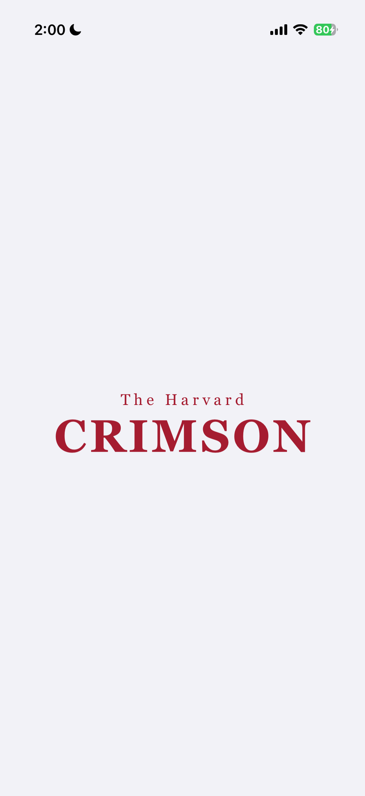
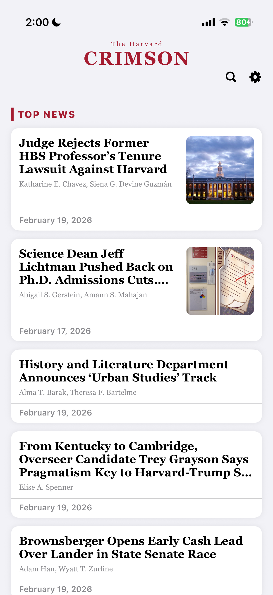
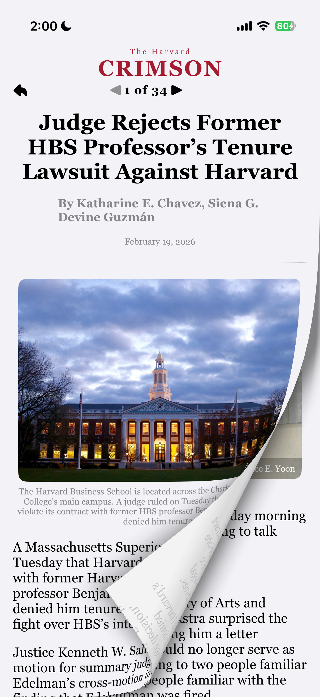

# The Harvard Crimson - iOS App

An unofficial iOS news reader for [The Harvard Crimson](https://www.thecrimson.com), built entirely with SwiftUI. The app scrapes articles directly from thecrimson.com and presents them in a clean, native reading experience with page-curl animations, dark mode, and real-time search.

## Demo

## Screenshots

  
  
  

## Features

### Article Feed
- Browse articles organized by section: **Top News**, **More News**, **Opinion**, **Fifteen Minutes**, **Arts**, and **Sports**
- Article cards display title, authors, preview image, and publication date
- Pull-to-refresh to load the latest articles

### Article Reader
- Full article display with rich content: paragraphs, images with credits, and pull quotes
- **Page curl animation** for swiping between articles using a native UIPageViewController wrapper
- Article pagination header showing current position (e.g., "3 of 45") with previous/next navigation
- Nearby article prefetching for smooth browsing

### Search
- Real-time search across all loaded articles by title
- Instant results as you type

### Settings
- Dark/light theme toggle with animated transitions
- Startup animation toggle
- App info and creator attribution

### Splash Screen
- Animated logo reveal with spring physics on launch
- Configurable on/off in settings

### Web Scraping Engine
- Extracts articles directly from thecrimson.com by parsing the embedded Apollo GraphQL cache — no API key required
- Parses full article content including paragraphs, images, and pull quotes
- Converts HTML to Markdown while preserving bold, italic, and link formatting
